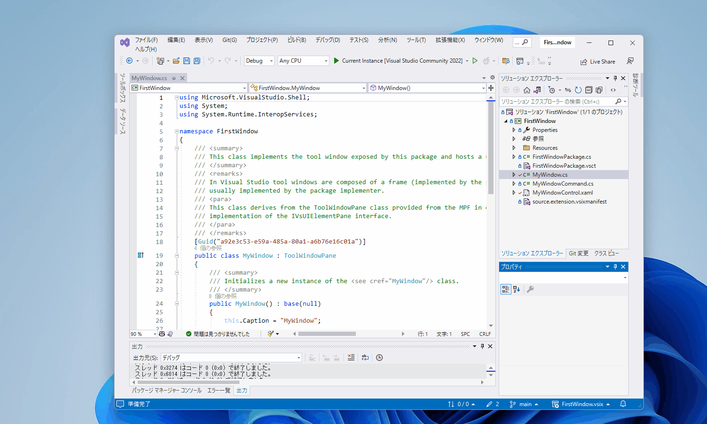

# VSIX

Visual Studioでの拡張機能開発のテスト用プロジェクト。  
チュートリアル通りに作った。  

  

## 参考文献

- <https://learn.microsoft.com/en-us/visualstudio/extensibility/creating-an-extension-with-a-tool-window?source=recommendations&view=vs-2022>
